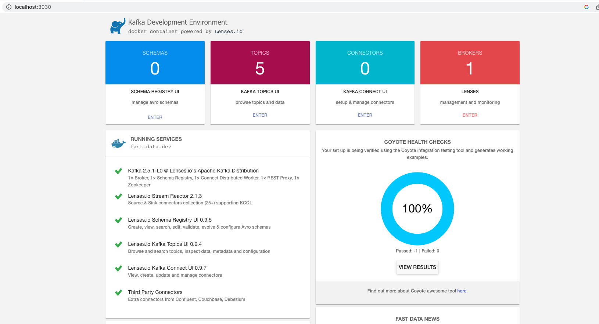
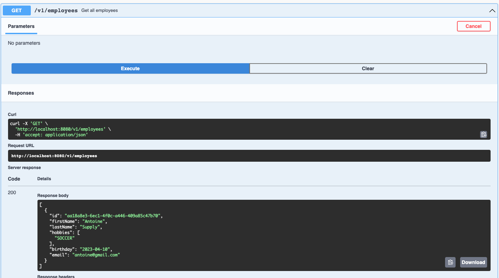
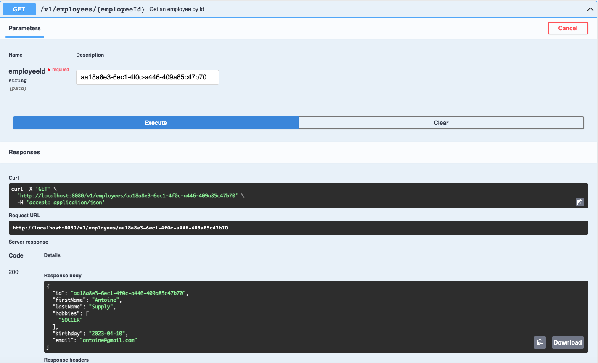
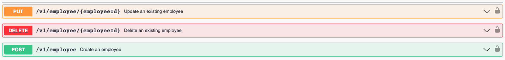
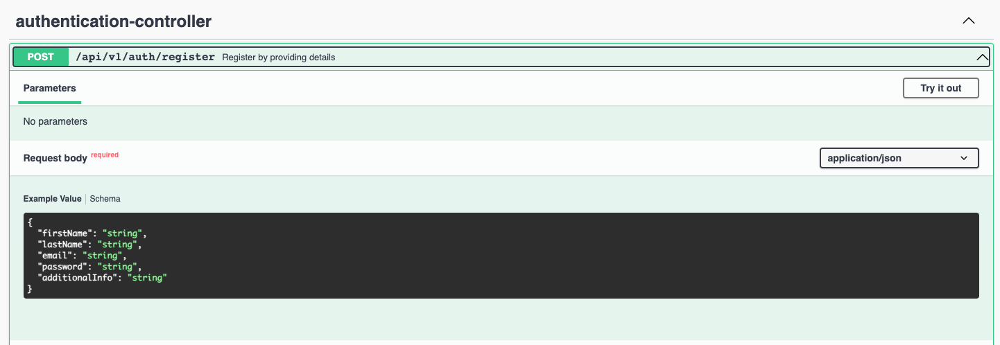
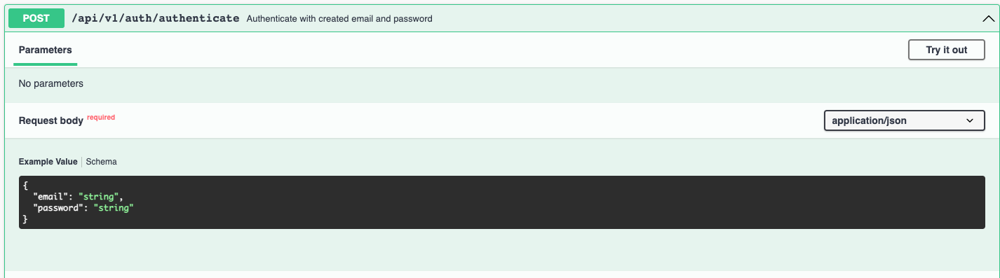
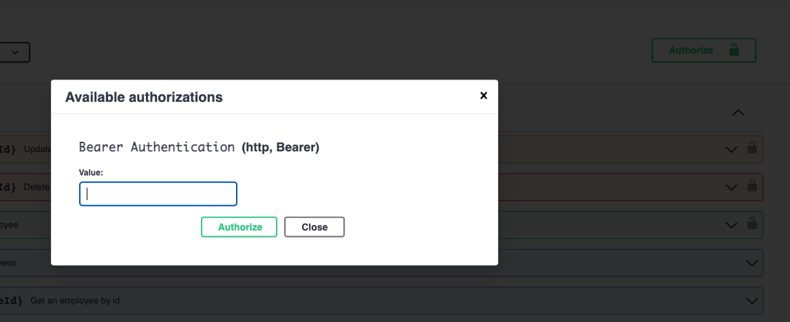
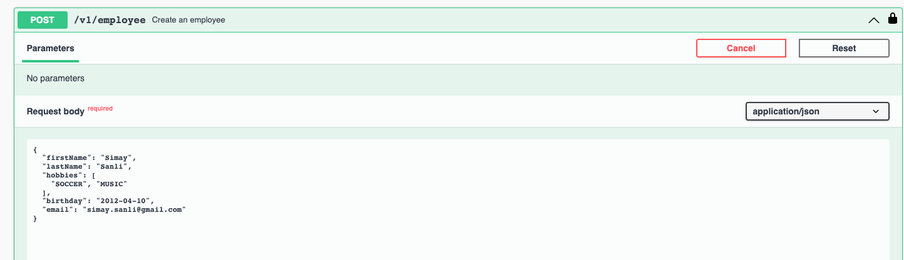
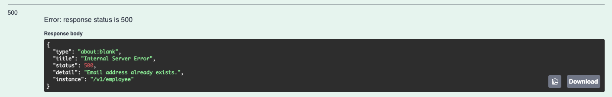
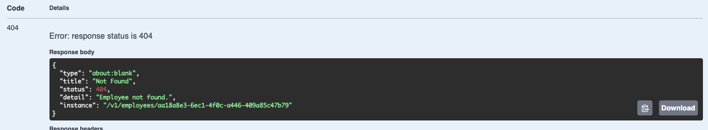

# Employee Service

The aim of this project is to provide get, create, delete and update employees.

### Setup

#### Requirements

- Docker
- Gradle
- Java 17
- Intellij IDEA

##### 1 Run dockerized services

The project uses Postgresql and Apache Kafka as docker containers. It takes about 3 to 5 minutes for all services to run on a computer.

Simply use:

 ```sh
$ docker-compose up  #to run containerized services
$ docker-compose down
 ```
 
 Kafka Cluster and related components can be monitored and managed by Landoop UI at `http://localhost:3030/`. This UI helps us to see topics, schemas and connectors.





##### REST endpoints with Swagger UI

The employee endpoints can be monitored using `http://localhost:8080/swagger-ui/index.html`.

##### Get Endpoints

The list of employees can be retrieved using the Get request section of Swagger UI. The get request does not require authentication.



The specific employee can be retrieved by id as shown below.



##### Authentication for Create, Update and Delete Endpoints with Spring Security and JWT Token

The create, update and delete requests require authentication.



To authorize create, update and delete endpoints:

Firstly, first name, last name, email and password should be entered for registration. 



Secondly, The provided email and password should be entered to below section to get JWT token.



After this operation, the token will be generated and entered to this section.



The employee can be created as below after authorization. After creating employee, update and delete operation can be done by employee id.



##### Exception(Error) Handling for Endpoints
Spring Boot provides a good implementation for exception handling for RESTful Services. **@ControllerAdvice** is a specialization of the @Component annotation which allows to handle exceptions across the whole application in one handling component.

The email field is unique so same email cannot be assigned to new or updated employee. It handles by **@ControllerAdvice**.



The employee not found is handled by **@ControllerAdvice**.



##### Coulda/Woulda/Shoulda


- I could have implemented more integration and unit tests.
- I would have used **@PreAuthorize** annotation to manage authentication of specific endpoints.
- I would have improved kafka implementation.
- I would have added tests for security and kafka implementation.
- i would have implemented front-end part to enhance user experience.